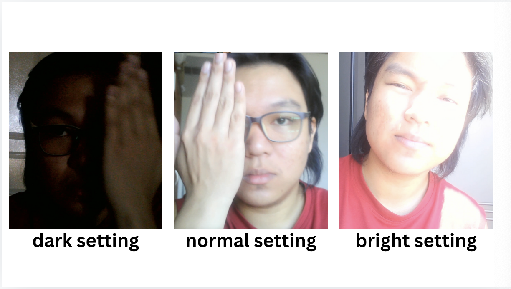
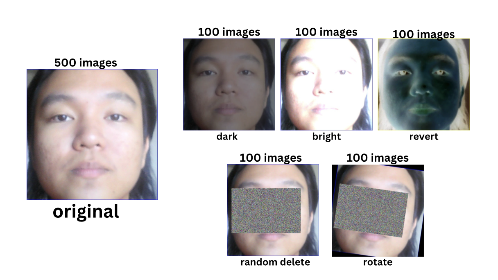
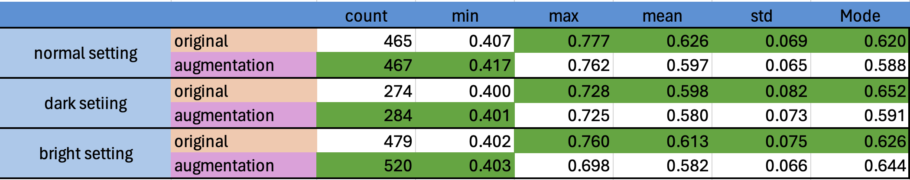

# Analysis Original vs Augmented in the small Dataset

## Overview

In this project, we perform an analysis of face recognition accuracy under different lighting conditions (normal, dark, and bright). Our dataset includes two types of images for each setting:

1. **Original (OG) images**: Unaltered images from the dataset (500 images).
2. **Augmented (AUG) images**: These images have been synthetically augmented to improve the robustness of our model under various conditions.(100 images per image processing technique)

The table above provides a detailed summary of accuracy statistics under these conditions, comparing original and augmented images. We conducted this analysis to understand the effectiveness of data augmentation and to optimize model performance by leveraging both types of data.

## Key Statistics Explanation

The table presents key statistics for each dataset, including:

- **Count**: The number of images used for training/testing.
- **Min**: The minimum accuracy score.
- **Max**: The maximum accuracy score.
- **Mean**: The average accuracy score across all images.
- **Std**: The standard deviation, which indicates how much the accuracy varies.
- **Mode**: The most frequent accuracy score observed.

### Normal Setting

- **Original**:
  - With 465 images, the accuracy varies between **0.407** and **0.777**, with a mean accuracy of **0.626** and a mode of **0.620**. The standard deviation is **0.069**
- **Augmented**:
  - With 467 images, the accuracy ranges from **0.417** to **0.762**, with a mean of **0.597** and a mode of **0.588**. The standard deviation is slightly lower at **0.065**, showing that the augmented images lead to more consistent performance.

### Dark Setting

- **Original**:
  - With 274 images, the accuracy ranges from **0.400** to **0.728**, with a mean of **0.598** and a mode of **0.652**. The standard deviation is **0.082**
- **Augmented**:
  - With 284 images, the accuracy ranges from **0.401** to **0.725**, with a mean of **0.580** and a mode of **0.591**. The standard deviation is **0.073**, indicating that augmented images help reduce the variability in performance.

### Bright Setting

- **Original**:
  - With 479 images, the accuracy varies between **0.402** and **0.760**, with a mean accuracy of **0.613** and a mode of **0.626**. The standard deviation is **0.075**.
- **Augmented**:
  - With 520 images, the accuracy varies from **0.403** to **0.698**, with a mean of **0.582** and a mode of **0.644**. The standard deviation is **0.066**, again showing reduced variability.

## Justification for Combining Original and Augmented Data

### Why Augmentation is Useful

- **Improved Generalization**: Augmented images provide the model with a broader set of examples, which improves its ability to generalize to unseen data. This is particularly important when the original dataset is limited. Augmentation simulates real-world variations (e.g., lighting changes), making the model more robust to different environments.
  
**from statistic show that using Augmentation dataset can increase the ability to detect more but still less accurcy.** 

### Why Original Data is Still Important

- **Maintaining High Accuracy**: The original images often have slightly higher maximum accuracy and mode values compared to the augmented set. This suggests that the original data may capture key features that are somewhat diluted by augmentation.
**from statistic show that original dataset still maintain the accurcy score.**

### Final Approach: Combining Original and Augmented Data

- We propose using **500 original images** and **500 augmented images** in the final project. This combination leverages the high accuracy and feature richness of the original dataset, while benefiting from the increased generalization provided by the augmented dataset.
  
- **Benefit**: This hybrid approach aims to capture the best of both worlds—maximizing accuracy while ensuring robust performance across different lighting conditions.

## Conclusion

In conclusion, this analysis demonstrates the importance of combining original and augmented data to improve model generalization and robustness. By using both, we aim to enhance performance in face recognition across varying environments while maintaining high accuracy. This approach is particularly crucial for applications in uncontrolled or real-world settings where lighting and other conditions are not always ideal.
